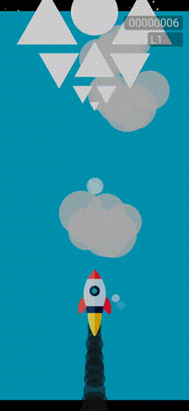

# Sky-Saver

Sky Saver was a mobile game built using Solar2D framework for iOS/Android, based on existing games I used to play on my phone.

I stopped working on this in 2024 due to the lack of support for the Solar2D framework.

**Mobile Game Development**

- Built cross-platform mobile game using Solar2D framework for iOS/Android
- Implemented real-time physics engine with custom collision detection algorithms
- Integrated Firebase Analytics and Firestore for cloud data persistence

**Performance Engineering**

- Developed custom performance monitoring system with FPS tracking
- Created efficient memory management with object pooling for particle systems
- Optimized rendering pipeline with layered parallax backgrounds
- Created unique physics-based bubble movement with inertia calculations

**Systems Architecture**

- Designed JSON-driven procedural level generation system
- Implemented custom plugin architecture for third-party integrations
